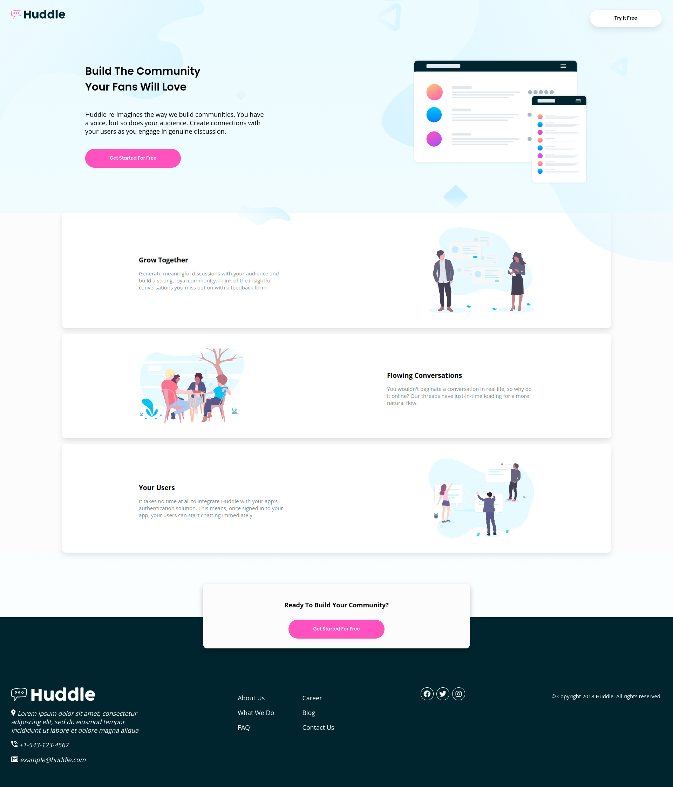
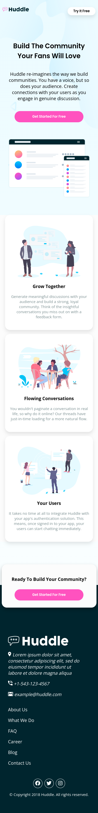

# Frontend Mentor - Profile card component solution

This is a solution to the [Profile card component challenge on Frontend Mentor](https://www.frontendmentor.io/challenges/profile-card-component-cfArpWshJ).

## Table of contents

- [Overview](#overview)
  - [The challenge](#the-challenge)
  - [Screenshot](#screenshot)
  - [Links](#links)
- [My process](#my-process)
  - [Built with](#built-with)
  - [What I learned](#what-i-learned)
  - [Continued development](#continued-development)
- [Mobile Screenshot](#mobile-screenshot)
- [Author](#author)

## Overview

### The challenge

Users should be able to:

- View the optimal layout for the site depending on their device's screen size
- See hover states for all interactive elements on the page

### Screenshot




### Links

- Solution URL: [Add solution URL here](https://your-solution-url.com)
- Live Site URL: [Add live site URL here](https://your-live-site-url.com)

## My process

### Built with

- Semantic HTML5 markup
- Flexbox
- Mobile-first workflow
- [Font Awesome](https://fontawesome.com/)

### What I learned

Managing bigger projects i.e. whole sites with more elements

Creating shadows surrounding buttons and card elements
```css
box-shadow: 0px 8px 15px rgba(0, 0, 0, 0.1);
```
Using Font Awesome 


### Continued development

Thinking in big picture when creating classes to speed up development process both for mobile and desktop

## Mobile Screenshot

## Author

- Frontend Mentor - [@Niklaus](https://www.frontendmentor.io/profile/NiklausRupail)