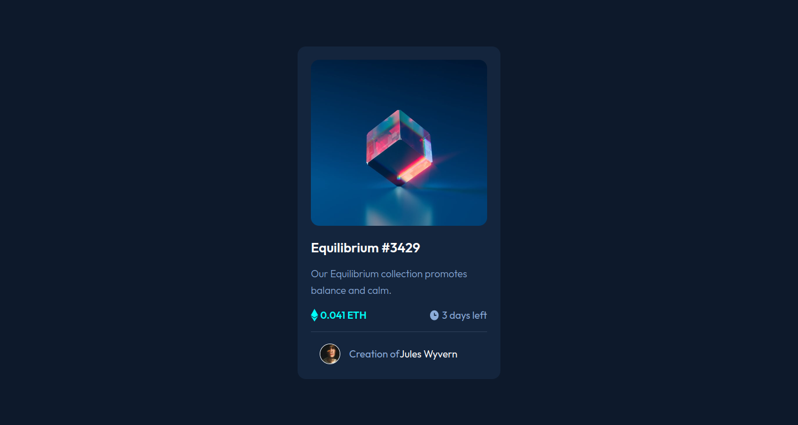

# Frontend Mentor - NFT preview card component solution

This is a solution to the [NFT preview card component challenge on Frontend Mentor](https://www.frontendmentor.io/challenges/nft-preview-card-component-SbdUL_w0U). Frontend Mentor challenges help you improve your coding skills by building realistic projects. 

## Table of contents

- [Overview](#overview)
  - [The challenge](#the-challenge)
  - [Screenshot](#screenshot)
  - [Links](#links)
- [My process](#my-process)
  - [Useful resources](#useful-resources)
- [Author](#author)

## Overview

### The challenge

Users should be able to:

- View the optimal layout depending on their device's screen size
- See hover states for interactive elements

### Screenshot

### Links

- Solution URL: [GitHub](./)
- Live Site URL: [Netlify](https://whimsical-begonia-eba5da.netlify.app/)

## My process

### Useful resources

- [css-tricks](https://css-tricks.com/video-screencasts/195-how-to-draw-a-line-with-css/) - How to draw the line between author and the NFT
## Author

- Frontend Mentor - [@Me](https://www.frontendmentor.io/profile/NiklausRupail)
